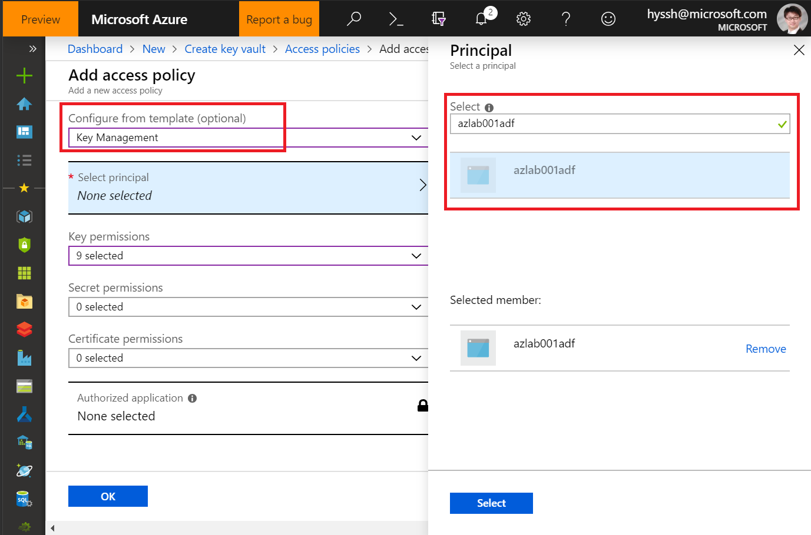
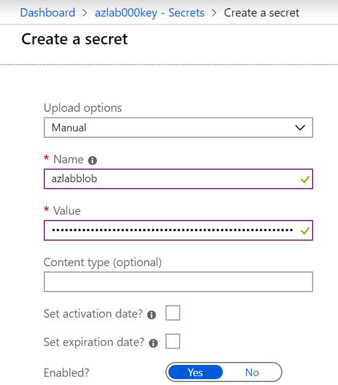
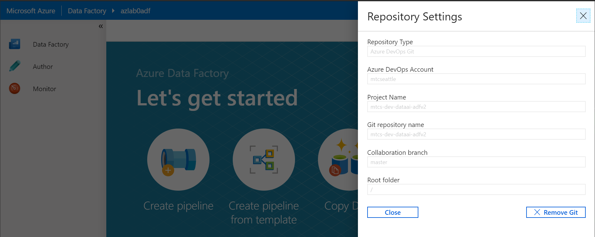

# 1. Azure Data Factory

Move data from Blob to ADLS gen 2

## 1.1 Lab Environment Configuration

### 1.1.1 Create Azure Key Vault

Create Azure Key Vault from Azure Portal

While creating the service, make sure you add your ADF service to _Access Policy_



When after the Azure Key Vault is created, add secret using following connection string and name is azlabblob:
```text
DefaultEndpointsProtocol=https;AccountName=mtcsdataai;AccountKey=d5XhBqQziobWFmcBhgFRzxP7PZZLMqqI0f9v5cCwG2F+Yemk4Z8rt75scnxdEt3GmvG84KEOeg5auZGzDE+KVw==;EndpointSuffix=core.windows.net
```



### (Optional) 1.1.2 Create a Project in Azure DevOps for ADF

Once you create the Azure DevOps project, you can add the git repo to ADF



## 1.2 Copy a CSV file from blob to ADLS

### 1.2.1 Create a Pipeline